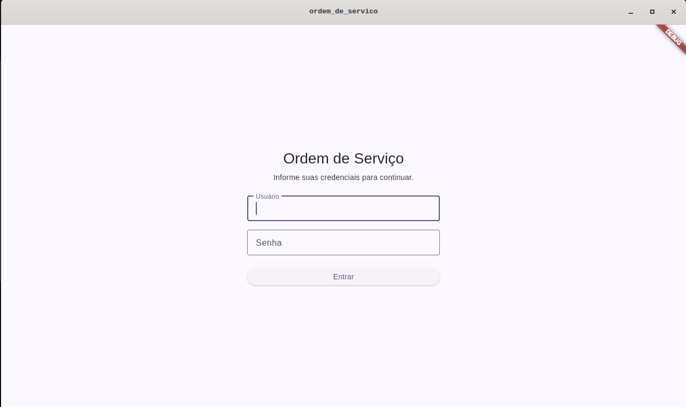
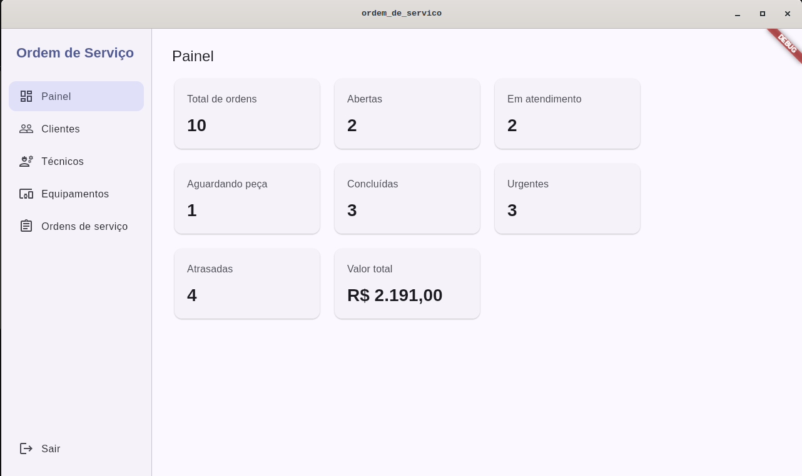
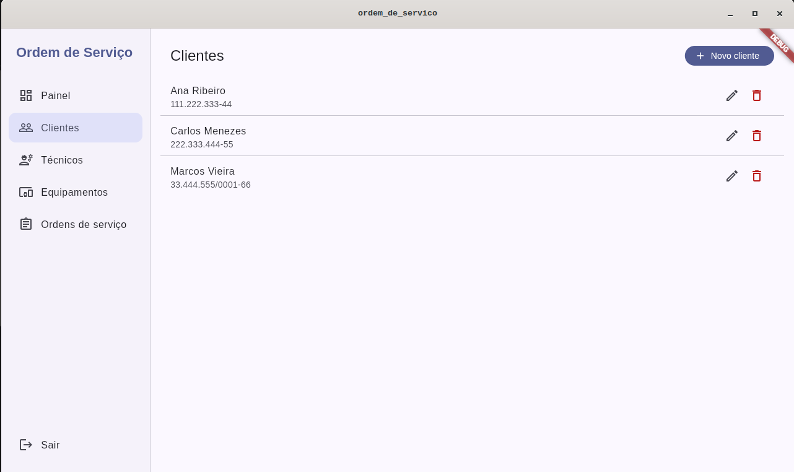
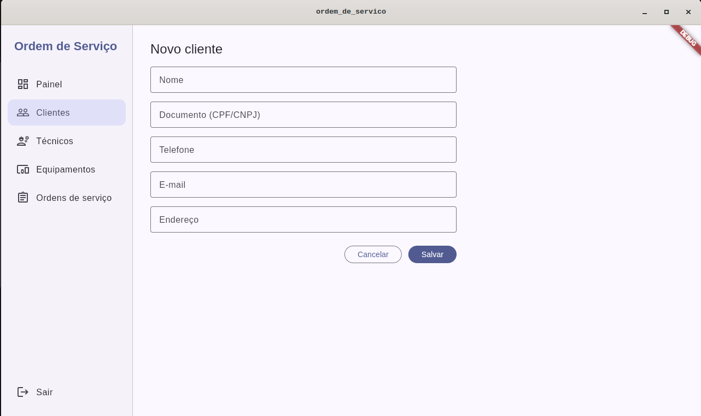
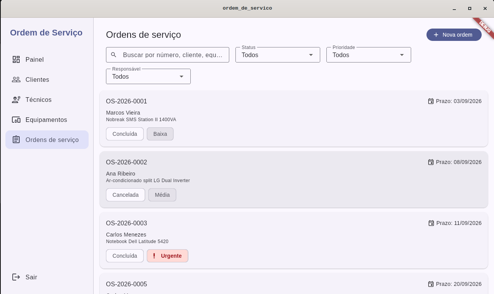
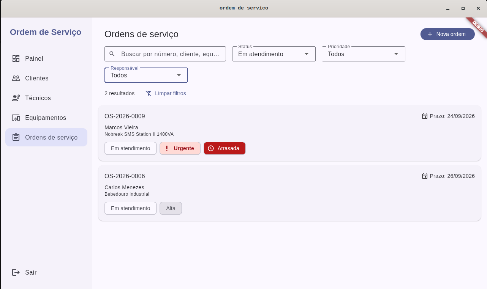
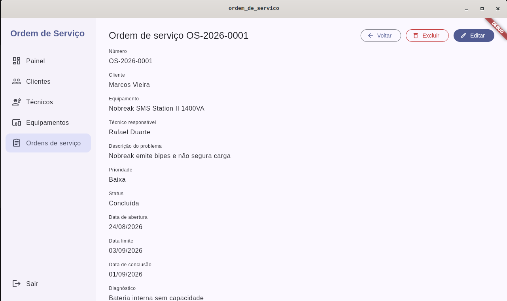
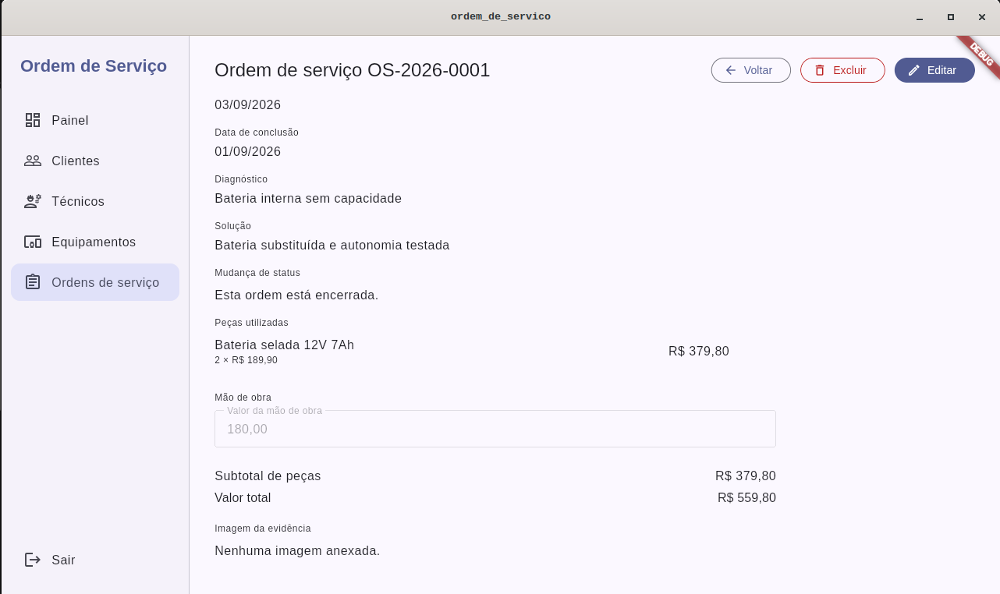

# Ordem de Serviço

Aplicativo desktop para Linux, feito em Flutter, para gerenciar ordens de serviço de manutenção: cadastro de clientes, técnicos e equipamentos, abertura e acompanhamento de ordens com controle de status, peças e mão de obra, e um painel de indicadores. Os dados ficam em um banco SQLite local.

## Pré-requisitos

- Flutter 3.47.2 (canal stable), versão usada no desenvolvimento. O `pubspec.yaml` exige Dart `^3.13.2`, que é o Dart incluído nessa versão do Flutter.
- Linux com o suporte a desktop Linux habilitado no Flutter (`flutter config --enable-linux-desktop`). O desenvolvimento e os testes foram feitos no Ubuntu 24.04.
- Pacotes de sistema para compilar o app Linux e usar o SQLite. No Ubuntu 24.04:

```bash
sudo apt-get install clang cmake ninja-build pkg-config libgtk-3-dev \
  liblzma-dev libstdc++-13-dev libsqlite3-dev
```

Rode `flutter doctor` para conferir se o toolchain de Linux desktop está completo.

O repositório também contém o runner Windows (`windows/`), mas o aplicativo não foi compilado nem testado no Windows.

## Como rodar

```bash
git clone https://github.com/wcardosos/ordem-de-servico-desktop.git
cd ordem-de-servico-desktop
flutter pub get
flutter run -d linux
```

Nenhuma configuração manual é necessária. O `main.dart` inicializa o `sqflite_common_ffi` (`sqfliteFfiInit()` e `databaseFactory = databaseFactoryFfi`) antes de abrir o banco. Na primeira execução o banco é criado com o schema e os dados de demonstração.

O banco (`ordem_servico.db`) e as imagens anexadas às ordens (pasta `images/`) ficam no diretório de suporte do aplicativo, que no Linux é `~/.local/share/br.com.manutencao.ordem_de_servico/`. Para voltar aos dados de demonstração, feche o aplicativo e apague o arquivo `ordem_servico.db`.

Para gerar o executável:

```bash
flutter build linux
./build/linux/x64/release/bundle/ordem_de_servico
```

Para rodar os testes automatizados:

```bash
flutter test
```

## Estrutura do projeto

```
lib/
├── main.dart          Inicializa o SQLite FFI, abre o banco e sobe o MaterialApp
├── core/              Enums (status, prioridade), regras de transição de status, validadores, máscaras, formatadores e dados de demonstração
├── models/            Entidades (Customer, Technician, Equipment, ServiceOrder, PartItem, User) com conversão de/para Map
├── services/          DatabaseHelper (conexão e criação do schema), cópia de imagens e seleção de arquivo
├── repositories/      Um repositório por tabela, com as consultas SQL
├── controllers/       ChangeNotifiers de cada módulo: carregam dados, aplicam regras e expõem estado para a tela
├── screens/           Login, shell com menu lateral, rotas e uma pasta por módulo com as views de lista, formulário e detalhe
│   ├── customers/
│   ├── dashboard/
│   ├── equipment/
│   ├── service_orders/
│   └── technicians/
└── widgets/           Componentes compartilhados: menu lateral, cabeçalho de seção, diálogo de confirmação, snackbar, estilo de botão destrutivo
```

## Funcionalidades

- Login com usuário e senha.
- Painel com contagem de ordens por status, urgentes, atrasadas e valor total.
- Clientes: cadastro, edição, listagem e exclusão, com máscara de CPF/CNPJ e telefone.
- Técnicos: cadastro com especialidade e indicador ativo/inativo. Só técnicos ativos podem ser atribuídos a uma ordem.
- Equipamentos: vinculados a um cliente, com tipo, marca, modelo, número de série e patrimônio.
- Ordens de serviço: abertura com numeração automática no formato `OS-AAAA-NNNN`, edição, busca e filtros por status, prioridade e técnico, peças utilizadas, valor de mão de obra e anexo de uma imagem (JPG ou PNG).
- Fluxo de status: Aberta → Atribuída → Em atendimento → Concluída. De Em atendimento a ordem pode ir para Aguardando peça e voltar. Cancelada é possível a partir de qualquer status que não seja Concluída ou Cancelada. Atribuir exige técnico definido; concluir exige diagnóstico ou solução.
- Exclusão bloqueada quando o registro tem vínculos (cliente com equipamentos ou ordens, por exemplo). Uma ordem só pode ser excluída enquanto está Aberta; depois disso, o caminho é o cancelamento.

## Capturas de tela

Login



Painel com os indicadores das ordens



Lista de clientes



Cadastro de cliente



Lista de ordens de serviço



Lista de ordens de serviço filtrada por status



Detalhe de uma ordem concluída: dados da ordem



Detalhe de uma ordem concluída: peças, mão de obra, totais e imagem



## Credencial de acesso

O banco é criado com um único usuário:

| Usuário | Senha      |
|---------|------------|
| admin   | admin123   |

Junto com ele são carregados 3 clientes, 5 equipamentos, 3 técnicos (um inativo), 10 ordens de serviço em status variados e itens de peças. As datas das ordens são calculadas a partir do dia da criação do banco, para que sempre existam ordens em dia e atrasadas.

## Decisões técnicas

O banco é SQLite acessado pelo `sqflite_common_ffi`, já que o plugin `sqflite` padrão não roda em desktop; o schema é criado no `onCreate` e as chaves estrangeiras são ativadas em cada conexão. O acesso a dados segue o padrão Repository: cada tabela tem um repositório com SQL explícito, que converte falhas em uma única exceção de domínio (`DatabaseAccessException`) tratada pelos controllers. O `DatabaseHelper` é um Singleton, com construtor privado e uma instância estática que mantém uma única conexão aberta de forma preguiçosa. O estado das telas é gerenciado com Provider: cada módulo recebe o seu `ChangeNotifier` por um `ChangeNotifierProvider` próprio, criado quando o módulo é aberto, sem estado global. Valores derivados são calculados, não persistidos: subtotal das peças, valor total da ordem e atraso são getters do modelo, e os indicadores do painel saem de consultas agregadas no momento em que o painel é carregado. As regras do fluxo de status ficam em uma tabela de transições válidas no `core`, verificada pelo próprio modelo antes de qualquer gravação.

## Limitações conhecidas

- A senha é gravada e comparada em texto puro, sem hash. Existe um único usuário semeado e não há tela para gerenciar usuários.
- Não há histórico de status: a ordem guarda apenas o status atual e a data de conclusão, sem registro de quem mudou o quê e quando.
- O documento do cliente (CPF/CNPJ) recebe máscara e é obrigatório, mas os dígitos verificadores não são validados.
- O valor total do painel soma mão de obra e peças de todas as ordens, inclusive as canceladas.
- O schema está na versão 1 e não há rotina de migração (`onUpgrade`); os dados de demonstração só são inseridos quando o banco é criado.

## Autor

Wagner Cardoso. Trabalho acadêmico.
